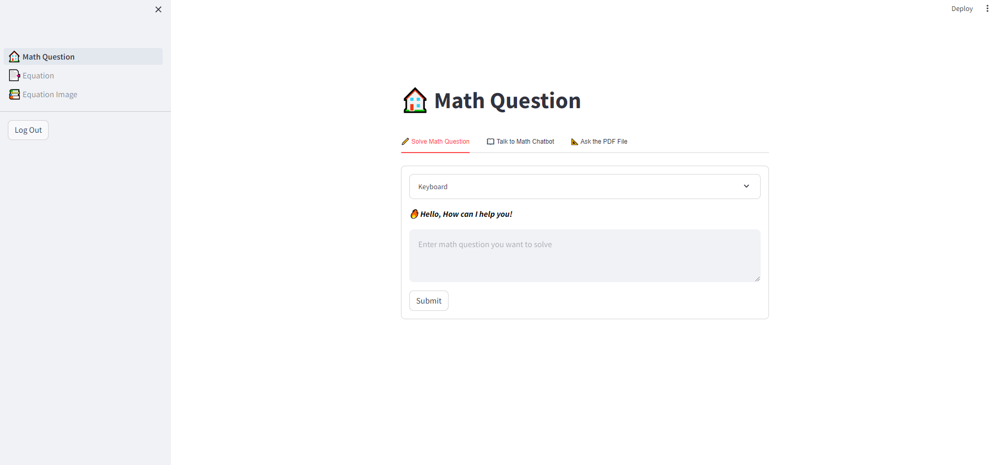

# Math-ChatBOT

## Explain files:
main.py: contain three main operations: Talk to Chatbot, Solve Math Question and Talk to PDF File 

OCR_equation.py: conduct OCR operation from input image

visualize_equation.py: visualize equation input which entered from user

## Usage:
### Recommended environment:
Please use ```pip install -r requirements.txt``` to install the libraries.

### Running ChatBOT:
Run ```streamlit run main.py```

## User Interface

<p align="center">

</p>
