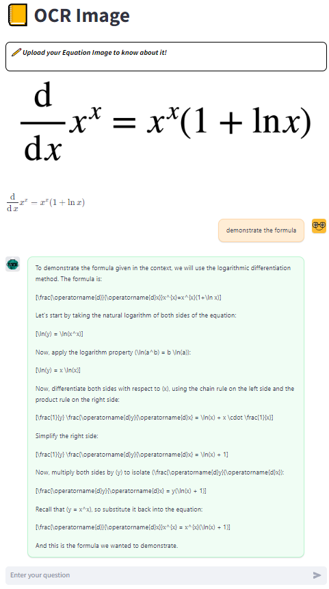

# Math-ChatBOT

## 🌱 Installation

```python
pip install -r requirements.txt
```

## 🚀 Running ChatBOT:
```python
streamlit run work.py --server.enableXsrfProtection false
```

## 👀 User Interface
- **Talk to Chatbot**
<p align="center">

</p>

- **Ask math question**
<p align="center">

</p>

- **OCR equation**
<p align="center">

</p>

- **Ask equation**
<p align="center">

</p>
